# Why doesn't anybody understand quaternions?

Recently the topic of the quaternion representation of 3D rotations came up again on Hacker News,
and a [comment made by 'ajkjk](https://news.ycombinator.com/item?id=29513184) inspired me to write this blog post.
'ajkjk gave a generally correct if abstruse description of the way rotations appear in Lie algebra,
peppered with musings of resentment:

>In particular there is no satisfying explanation for what the geometric product means that I'm aware of (and I have read more-or-less everything there is on the subject). 

>[...]

>Anyway I think that this is a relatively 'unsolved' space, pedagogically. There is probably a really good explanation of why this all works that feels like it is still missing and doesn't involve any magic handwaving steps at all. 

This is far from an uncommon take. In fact, regardless of whether you're a "fan" or "hater" of geometric algebra,
you probably feel like you don't understand quaternions even after reading your 378th article on the topic.

Here's the takeaway from this blog post:

### Right-multiplication of a unit quaternion onto a target quaternion comprises two rotations of the target, of equal magnitude in two fully orthogonal planes, and left-multiplication by the same unit quaternion comprises two rotations of equal magnitude in the same two planes, but one of the directions is reversed. Therefore, by multiplying on the right and the left, we can obtain a rotation in only one plane.

When we combine this with a simple fact about rotations in 3D --- the fact that any rotation in three dimensions equates to rotation in a *single* plane --- we are eventually led to the famous rotation formula for 3-vectors in a quaternion algebra, which looks like this:

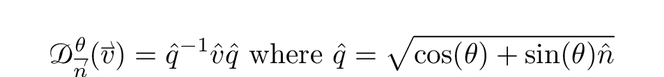

In the above expressions, we replace the vector and unit-vector diacritics from *v* and *n* on the right-hand side
because we are now treating them as quaternions, rather than vectors. You might be wondering why I put that
square root there, or why I used an inverse rather than a conjugate, as is more popular -- this will make more sense later.
For the remainder of this
article, I will assume the reader has a working familiarity with linear algebra on 3-vectors, dot products, cross products, et cetera.

This post is written to satisfy the reader who wants to understand "why quaternions work that way". It is not a practical introduction
to the use of quaternions in computer software, and we do not discuss the advantages of quaternions over other rotations.
For that, there are plenty of excellent reference materials elsewhere, such as [this one](https://liorsinai.github.io/mathematics/2021/11/05/quaternion-1-intro.html)
or [this one](https://www.youtube.com/watch?v=zjMuIxRvygQ&t=24s).

(Some readers will recognize that using conjugates instead of inverses allows our quaternion to also describe scaling,
in addition to rotation. This is true and useful, but in order to focus on rotation, I want to ignore scaling. Once
you understand rotation with quaternions, it is trivial to incorporate scaling!)

## Fully orthogonal planes: a toe in the water of four-dimensional geometry

Now in order to make any sense of this, we need an understanding of what a pair of "fully orthogonal planes" is. Recall that any two planes in 3-space
are either parallel or coincide in a line. But quaternions occur in 4-space, so we need to think about 4-space. 

What is a plane in 4-space? Well, what is a plane in *any* Euclidean space? A plane has two orthogonal axes, and we can get to any point from the origin
by translation along one axis and then the other. Translation of a distance *d* along an axis ***A*** in Euclidean space can be represented by adding the vector

When we fix a unit vector, we also choose a direction for the axis. That means that for any plane ***P***, we should be able to choose *two* unit vectors, and *parameterize*
the plane by two coordinates *α*, *β*, so that:

Here we are using [set-builder notation](http://en.wikipedia.org/wiki/Set-builder_notation) which says, roughly, "***P*** is the set of all points formed by linear combinations
of two orthogonal unit vectors", although we have not defined the vectors. In fact, we only need to require that the vectors are not parallel, but it makes our life (much!)
easier to require that they are orthogonal. 

Now we could proceed to an abstract argument about rotation in any plane, but since we are interested in 4-space, let's create a plane in 4-space. For any point in 4-space,
we can write:

so why don't we choose the unit vectors

Consider the contrast with the three-dimensional case. For a plane in three dimensions, there is exactly one unit
vector which is orthogonal to both of the planar axes. But here, we have two normal vectors:

Here δ(i,j), usually written with i and j as subscripts, represents the [Kronecker delta](http://en.wikipedia.org/wiki/Kronecker_delta), which returns 1 if i = j, and 0 otherwise.

Now let's consider a rotation *D*{***P***,θ} in the plane ***P***. We should find that:

and since we know that rotation is a linear transformation, we can write

So we can define another plane which is totally unaffected by rotations in the plane ***P***:

Now what happens with rotations in this plane? We expect to find (the reader can easily check):

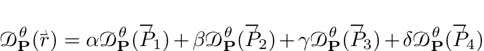

We are ready to learn the **first unexpected fact** about rotations in 4-space:

The above equation shows that rotations about ***P*** and ***P***^⊥ commute with each other! This is a striking contrast from the case of three dimensions.
This happens because every ray in ***P*** is orthogonal to ***P***^⊥, and every ray in ***P***^⊥ is orthogonal to ***P***, which is not possible
if we only have three spatial dimensions.

It is a *little* harder to see that every point unaffected by *D*{***P***,θ} lies in ***P***^⊥, but still basically straightforward. Since Euclidean space
is highly symmetric, we expect this property to be true for any plane: there is a unique "planar axis" comprising all of the points unaffected by rotations
in any plane, and these form a pair of fully orthogonal planes, and rotations in these fully orthogonal planes commute with each other.

This is easy to prove using "conventional" linear algebra: for any plane ***Q***, we can define a rotation matrix that maps the unit vectors defining ***P***
onto the unit vectors defining ***Q***, and then applying this matrix to the unit vectors in ***P***^⊥ will give orthogonal unit vectors that describe the
desired normal plane ***Q***^⊥. This proof is a standard application of the change-of-basis formulas, and it is rather long and jejune, so it is omitted for brevity.

# Multiplying quaternions by unitary "complex numbers": geometrical interpretation of some quaternion multiplications

In order to focus on geometrical interpretations, we will be brief. Quaternions are points in 4-space equipped with the usual Euclidean vector addition,
and we define a multiplication on these points by choosing one axis to be the "real" axis so that each quaternion has a real part and a vector part:

and William Rowan Hamilton famously discovered that we can define an associative, distributive and invertible multiplication on these 4-vectors as follows:

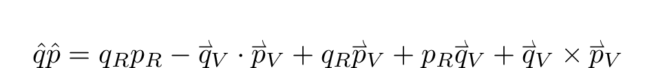

That this multiplication satisfies the associative and distributive axioms can be found in any number of sources which introduce quaternion algebra,
and [the Wikipedia article](http://en.wikipedia.org/wiki/Quaternion) is generally sufficient. We can also write this as a consequence of Hamilton's equation
extended with the distributive property, but while this is helpful as a computational and mnemonic tool, it provides no further geometric intuition.

What *matters* about the quaternionic multiplication is that it is associative, distributive, and invertible; that is, it does what we *want* from multiplication.
In the language of abstract algebra, quaternions form a *division ring*, and in fact they comprise the *largest* possible associative division ring.
In practice, and for most of this article, it is almost always clearer and more intuitive to use the vector-based definition of multiplication rather than Hamiton's equations.

## Right-multiplying quaternions by unitary complex numbers

You are probably familiar with the idea that multiplying one complex number by a unit complex number results in a rotation of the first number.
A unit complex number can be parameterized by the angle it makes with the real axis: u(θ) = cosθ + i sinθ. Then for any complex number *z*

When we consider the same multiplication applied to a quaternion, we recall the intuition developed in the previous section and decompose q into
components within and orthogonal to the complex plane:

But since we are not really in the field of complex numbers anymore, we rename the plane which contains the real axis and the *i*-axis:

Now by linearity, we know that

Since the parallel component obeys the usual multiplication rules for complex numbers, we can immediately represent the first product as a rotation:

Now, we need to be a little more specific about this rotation, since there are two ways to rotate by the angle θ in a plane. We write
the rotation operator D{1, *i*, θ}, to represent a rotation which takes the unit quaternion 1 to the unit quaternion *i* when θ = π/2.
Essentially, in order to represent rotations uniquely, we need to choose an order for the two unit vectors which form a basis of the plane.
In this case we have:

What about the second component? According to the multiplication described above, and noting that the dot product is zero (by orthogonality)
and the perpendicular component has no real part, we must have:

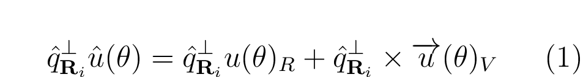

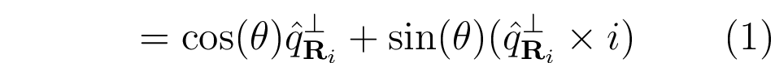

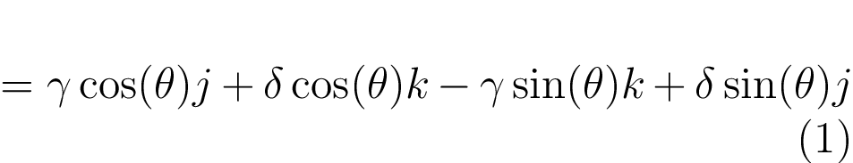

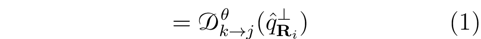

Putting it all together, we find that

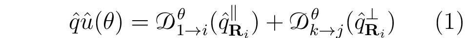

Now since (using the symbol ⊥ to mean "is perpendicular to")

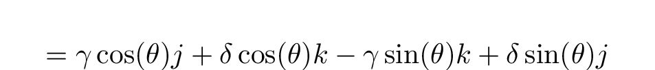

we find that each component is unaffected by rotations in the plane it is orthogonal to (since they lie in fully orthogonal planes, described above):

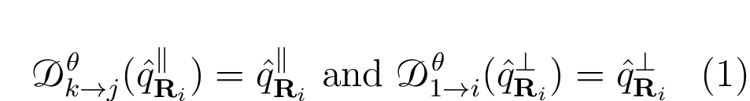

so we can write a more symmetrical equation:

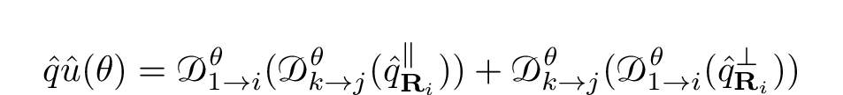

and since rotations in fully orthogonal planes commute with each other, as we learned above,

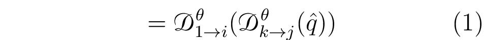

We have finally arrived at a **purely geometrical characterization** of what happens when we right-multiply a quaternion by a "unit complex" quaternion, that is,
a unit quaternion in the (1, i)-plane. This multiplication corresponds to a rotation in the (1, i)-plane by an angle θ, and a rotation in the (k, j)-plane also by θ.

## Left-multiplying a quaternion by a unit complex number

Okay, so what happens when we multiply on the *left*, rather than on the right? We get the same decomposition:

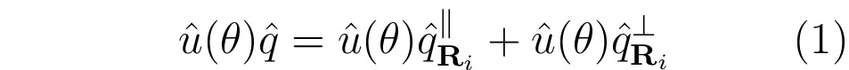

Since two quaternions with only (1, i) components will commute with each other, we can immediately express this as a rotation:

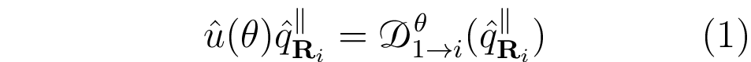

What about the other component? Applying the multiplication formula,

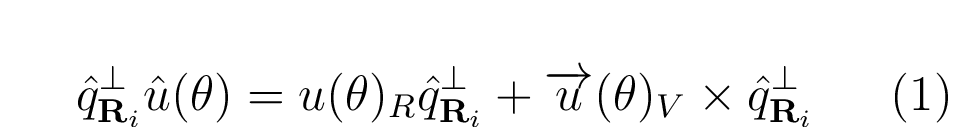

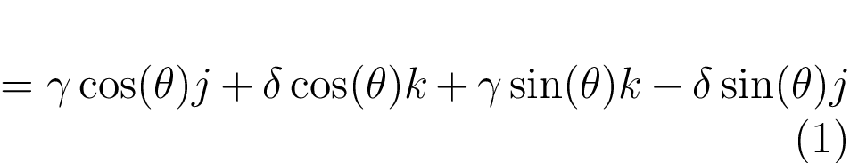

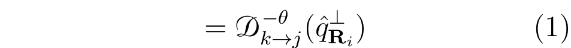

Applying the same rules about orthogonal components unaffected by rotations and fully orthogonal rotations commuting, we conclude:

## Rotations in a single plane

We finally have a chance to construct a rotation in only one plane. Let's just combine the transformations we've been looking at:

Now since rotations in fully orthogonal planes commute with each other, and rotations in the same plane commute with each other, we can
re-order the rotation operators:

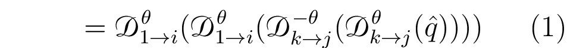

Now we have a rotation in one plane!

## Inverting rotations and conjugation

But what about the other plane? When we have a +θ on both sides, the rotations in the (1,i) plane have the same sign and
the rotations in the (k,j) plane have opposite signs. What if we have opposite signs on either side?

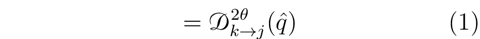

It is not hard to show that

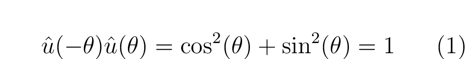

which satisfies our intuition that the inverse of a unit quaternion should produce the inverse of both rotations. 

# Geometrical interpretation of multiplication by an arbitrary unit quaternions and construction of arbitrary rotations

First, we need a lemma.

## The quaternionic square of an arbitrary unit vector is -1

Suppose u is a unit vector, and consider its square in quaternion multiplication. We have:

In other words, quaternions do not just define two new square roots of -1; instead, there is a whole 2-sphere of possible square roots
of -1. This is why quaternions are generally interpreted as an algebra over the reals rather than a field extension as with **C**.

## Another way to represent unit quaternions

Now consider an arbitrary unit quaternion. By the definition of the Euclidean norm for quaternions,

so we write out the product

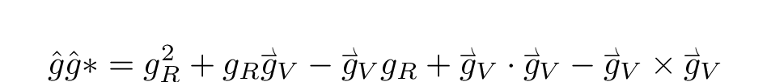

Now since both addends must have absolute value less than 1, we can find some angle θ such that

Therefore we can find a unit vector such that

## Decomposing right-multiplication by an arbitrary quaternion

We are finally in a position to provide a geometrical interpretation of multiplication by an arbitrary unit quaternion.
We are analyzing

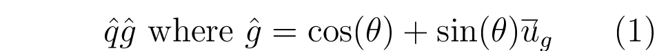

so, as before, we construct the plane containing *g* and the real axis:

and we can decompose the left quaternion into components within and orthogonal to this plane of interest:

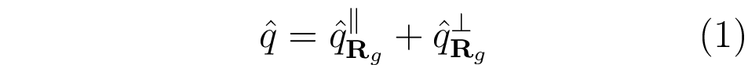

where we define the parallel component in the usual way, and for the perpendicular component we just decompose into magnitude and direction

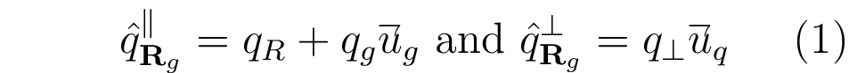

Now obtaining a geometrical interpretation of what happens to the in-plane component is very similar to last time (we could express all of this by changing
coordinates, but I think it is better to be as explicit as possible):

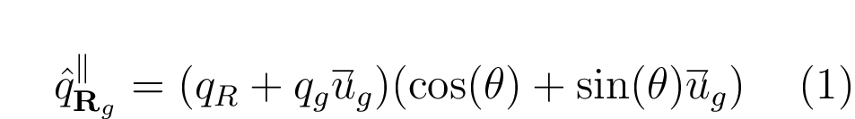

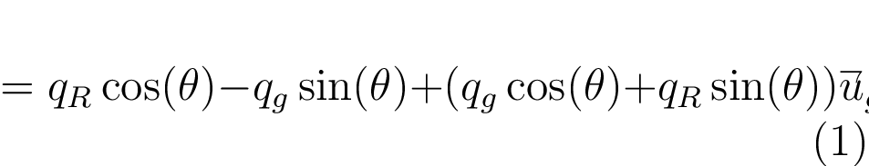

You can probably guess by now what is going to happen to the perpendicular component. But first we need to define the orthogonal plane.
According to the usual properties of the cross product:

so the cross product gives a fourth basis vector uqg which is orthogonal to ug and uq, providing a parameterization of the orthogonal plane
and also another basis for the whole set of quaternions:

[$\mathbf{P}_g^{\bot} = {\alpha \overrightharpdown{u}_q + \beta \overrightharpdown{u}_{qg} | \alpha, \beta \in \mathbb{R}}$]:

So we can write:

Once again we obtain an expression involving rotations in two fully orthogonal planes applied to the components of *q* which lie in each plane:

We can combine these rotations just as we did before: they do not affect the "opposite" component due to orthogonality, and they commute because
they are in fully orthogonal planes. Therefore, we have reached the promised **geometric interpretation of multiplication by any unit quaternion**:

In words, when we multiply an arbitrary quaternion *q* by a unit quaternion *g*, we can define the *g*-unit as the unit quaternion parallel to the vector
part of *g*, the *g*-phase as the angle that *g* makes with the real axis, the *g*-plane as the plane containing both *g* and the real axis, 
and the *g*-cross-plane as the plane orthogonal to both *g* and the real axis.
Then right-multiplication by *g* comprises a rotation in the *g* plane oriented from 1 to the *g*-unit with a magnitude of the *g*-phase, and a rotation
in the *g*-cross-plane which is taken in the positive direction around the *g*-unit with a magnitude of the *g*-phase, where "positive direction" is just
the usual right-hand-rule for rotations in the 3-space of purely vector quaternions (ai + bj + ck, i.e. 3-vectors).
Crucially, because these rotations are taken in fully orthogonal planes, they commute with each other!

## Geometric interpretation of left-multiplication

Since the only non-commutative part of quaternion multiplication is the cross product, we can infer that

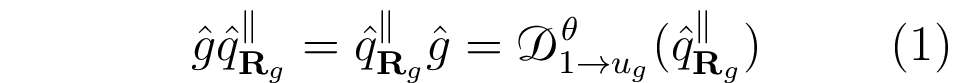

For the perpendicular component we find an inversion:

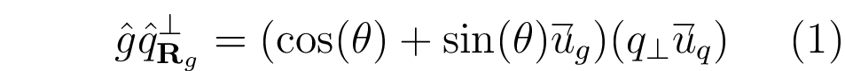

So finally

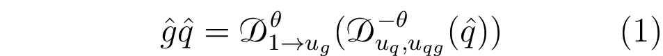

# Constructing and combining rotations with quaternions

There is a problem with the notation we developed in the previous section. Specifically, uq appearing in the last formula depends on the transformed
quaternion q, while we were trying to express rotations for an arbitrary q. So the right-hand-side expression in terms of *D*{uq, uqg, θ}
is not as general as we would like. But the unit vectors here serve only to clarify the orientation of the rotation, and we know that the rotation for positive θ is
considered to be in the positive direction around u<g>. Likewise, we have been ignoring that θ is a function of g. This suggests the more general equivalent notation:

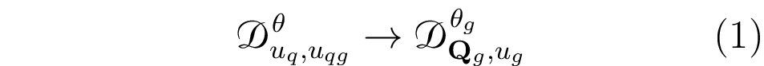

where now we only refer to the cross-plane ***Q***{g} with the positive orientation defined by ug. Now we have two ways to construct a single rotation
using an arbitrary unit quaternion:

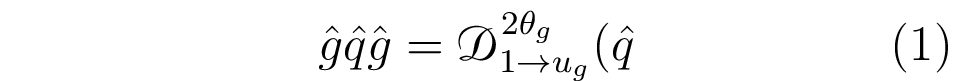

and

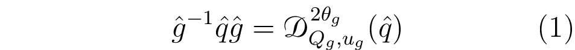

The second possibility is the common Rodrigues formula for rotation with quaternions. It has the useful property that, since the *g*-cross-plane is always orthogonal
to the real axis, it takes pure-vector quaternions to pure-vector quaternions, i.e. 3-vectors to 3-vectors. 

But in order to understand why the Rodrigues formula is *way* better than the symmetric version, we should look at what happens when we combine quaternion rotations.

## Combining conjugate rotations: the quaternion advantage

If we rotate symmetrically with two unit quaternions g and h,

then in order to pre-compute the combination of rotations, we need to find *both* products *gh* and *hg* of the rotation quaternions *g* and *h*. And there is no way to
find *hg* if you only know *gh*: consider the case where g = i, h = j, or g = 1, h = k.

In contrast, if we are using the conjugate rotations, we find that

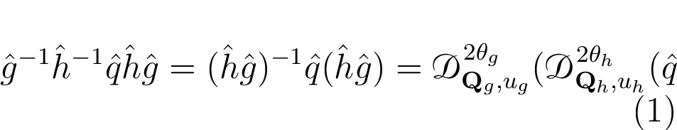

So in order to combine rotations in this formalism, we just take the product *hg*! We have the "limitation" that we can only rotate orthogonally to the real axis, but since
we were originally interested only in 3-space rotations, this actually becomes an advantage.

## Rotating a complex number with a quaternion

One thing that people often get stuck on when learning about quaternions is an objection like this:

> If quaternions are just an extension of the complex numbers, why do we multiply to rotate a complex number, but conjugate to rotate a quaternion?

Now that we have the fully geometrical interpretation of quaternion multiplication, we can write down what happens when we multiply a complex number *z*
by a unitary complex number *u*, according to the quaternion rules:

But since the z is orthogonal to the rotation in the (k, j)-plane, we just get

In other words, since the second rotation is fully orthogonal to the complex plane, it can be ignored. So there is no need to get rid of it somehow. In reality
complex multiplication is using the "bad" symmetric rotation representation instead of the "good" conjugate representation, because there is only one plane, so
everything is commutative and we don't need to be clever. In other words, we have:

where the rightmost expression reproduces the symmetric rotations above. We can't rotate the real part of a complex number using the conjugate representation,
since it only affects imaginary parts. But if we write a 2-vector v = xi + yj, then:

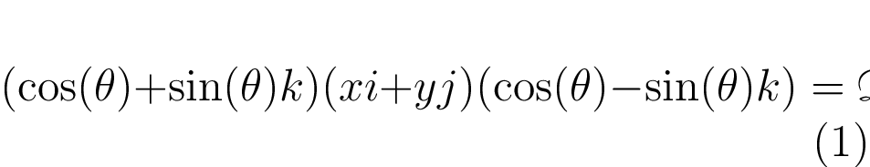

by a straightforward application of the formulas above. 

Of course, the simple answer is that multiplying by a quaternion *does* rotate --- it just happens to give us *two* rotations, which is more than we bargained for!

## Conjugates vs inverses: capturing scale transformations in the quaternion conjugation representation

I have expressed the rotation formula using the multiplicative inverse, rather than the conjugate, which is contrary to most reference materials on this topic.
This is because I want to emphasize the geometric intuition that the multiplicative inverse is also a "geometric" inverse which undoes the geometrical effect of
multiplying by a quaternion. In particular, it is much easier to understand why multiplying by the inverse will invert both rotations, while we need to
provide a justification if we are using the conjugate.

However, there is a significant advantage to the use of conjugates. First, notice that for any unit quaternion *g*, the conjugate is equivalent to the inverse:

But if we multiply *g* by a real number (magnitude) *G*, we get a different behavior:

where the last equality is established because multiplication by real numbers is always commutative (in math terms, **R** is the *center* of **H**). Now let's try
putting these scale factors into each version of the rotation formula:

but

So if we use the conjugate definition of rotation, we can also multiply our rotation quaternion by a real magnitude and represent scale transformations as well.

## But *why* is quaternion multiplication associative?

Suppose we wanted an associative cross product. We have a problem:

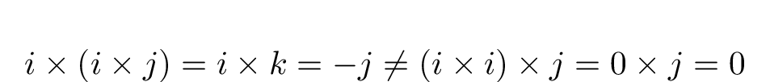

This is annoying. But we can see that the problem would go away if we could somehow define

Here I have used the superscript *A* to denote the "associativization" of the cross product. If we replace i → j → k → i in the above
equations, we end up with the similar identities

In fact this "just works", and if you extrapolate from this "associativized" cross product,
you reproduce the *exact* form of Hamilton's equations!

## I want to talk about spinors

Why not? So anyway, the quaternion representing a rotation of θ about an axis n in the conjugate representation is:

Now if θ = 2π, we expect to find q = 1, but in fact:

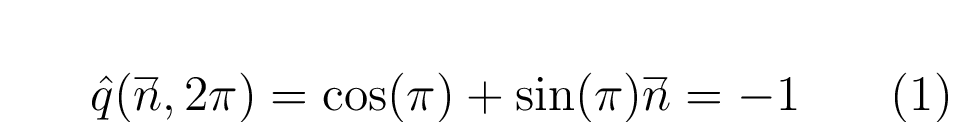

Evidently we need a rotation of 4π in order to bring the rotation quaternion back to unity: it remains "inverted" when describing a 2π rotation, even though
this rotation is equivalent to the identity. This is one of the most common examples of a *spinor*, which describes rotations of one object which are
"tied" to another object. In this case, the "tie" happens because we are insisting that the "real part" be unchanged by the quaternion rotation, which results
in a spinor representation.

